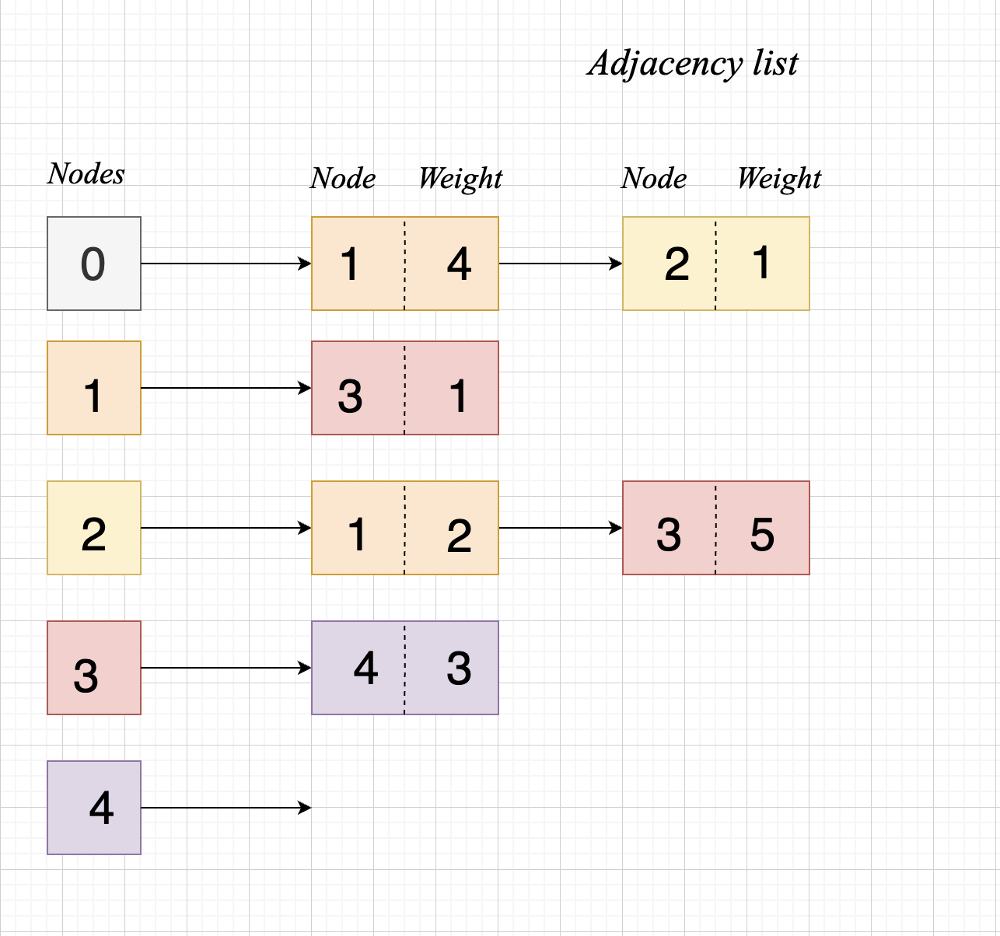
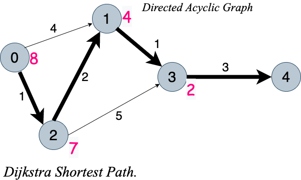

# a_star_search

Let's Implement the A star search Algorithm

A good reference video: <https://www.youtube.com/watch?v=ySN5Wnu88nE>

A star search is a preferred and an optimised solution to finding the shortest path to from a start point to an end point as it makes use of heuristics.

This youtube [video]( <https://www.youtube.com/watch?v=ySN5Wnu88nE>) does a very nice job on explaining the concept and it's also the inspiration behind my attempt at it writing this simple A star seach algorithm.

`Distance table: Example usecase`
|||||||
| :--- | :--- | :--- | :--- | :--- | :--- |
| Nodes/Vertices| 0 | 1 | 2 | 3 | 4 |
| Distance from node | 0| 3| 1| 4| 7|
| heuristics| 8 | 4 | 7 | 2 | 0 |

## Adjacency list



## Weighted Graph with euclidean heuristics



## Result

```shell
dijkstra git:(master) go run main.go
Distance array:  [0 3 1 4 7]
Shortest Path:  [2 1 3 4]
Shortest Distance:  7
```
